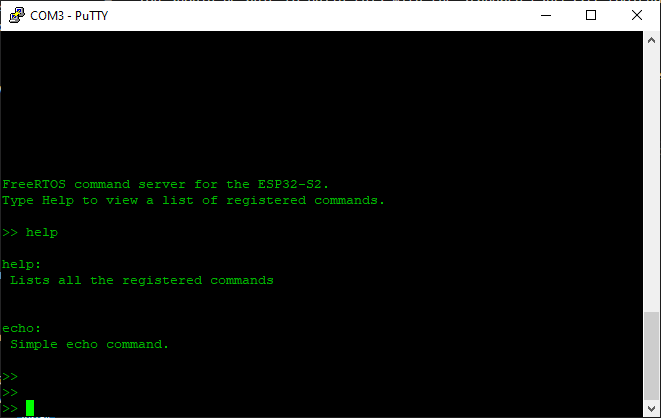

# FreeRTOS-Plus-CLI for the ESP32-S2
This is a base project containing FreeRTOS-Plus-CLI for the ESP32-S2

You should be able to build this with the standard Espressif toolchain.

## Note
Not all terminal emulators support all ANSI terminal features, so beware of that if you see some strange behavior. PuTTY has worked well for me so far.

